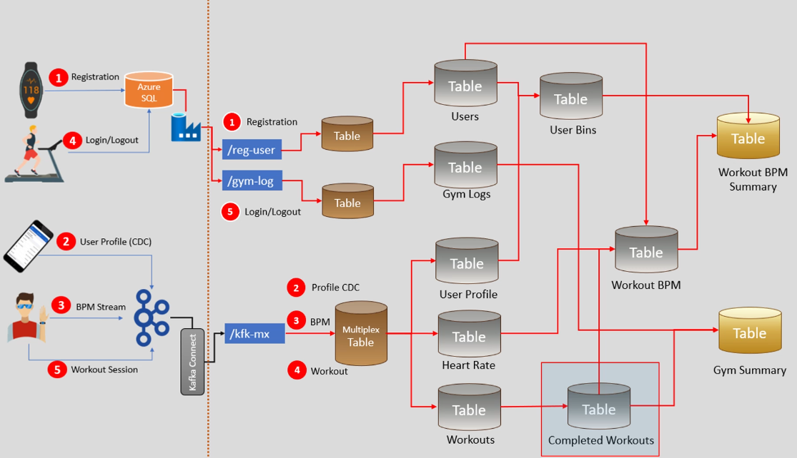

Azure Databricks Lakehouse Data Warehouse Project
This capstone project demonstrates an end-to-end implementation of a Lakehouse data warehouse utilizing the Medallion architecture. The process involves loading data from Azure Object Storage into a multi-layered table structure (Bronze, Silver, and Gold) and establishing the logic for data transformation and report generation.

Project Design Overview
The Lakehouse design integrates various components of Azure services to facilitate a seamless data flow from raw ingestion to analytical reporting.

!Lakehouse Design Overview

Implementation Steps
1. Set up Azure Storage:

Create an Azure Storage account.
Establish a container with three directories: sbi-managed-dev, sbi-metastore-root, sbi-unmanaged-dev.
2. Configure Databricks Environment:

Create a Databricks workspace.
Set up the Azure Databricks connector.
3. Role Assignment:

Assign the ‘Storage Blob Contributor’ role to the Azure connector.
Record the connector ID for future reference.
4. Initialize Databricks Workspace:

Launch the Databricks workspace.
Under ‘Catalog’, create a metastore and link it to ADLS Gen 2 using the Azure Databricks connector.
5. Catalog Configuration:

Integrate the workspace with the metastore.
Map the ADLS storage account to the catalog as external data.
6. Database Creation:

Construct the catalog and corresponding databases.
7. Data Ingestion Logic:

Develop the logic to transfer data from object storage to the Lakehouse database, progressing through the Bronze to Gold layers.
